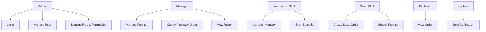

# 03. Use Case Design

## 1. Actors
| Actor | Vai trò |
|---|---|
| Admin | Quản trị hệ thống, phân quyền, cấu hình |
| Manager | Xem dashboard, phê duyệt, báo cáo |
| Warehouse Staff | Quản lý kho, nhập/xuất, kiểm kê |
| Sales Staff | Tạo đơn bán, quản lý khách hàng |
| Supplier | Cung cấp thông tin và đơn mua |
| Customer | Đặt hàng / theo dõi đơn |
| System | Tự động xử lý notification, audit, queue |

## 2. Use Case chính
| Use Case | Actor | Mô tả |
|---|---|---|
| Login | Admin, Manager, Staff | Đăng nhập hệ thống |
| Manage User | Admin | Tạo/sửa/khóa user |
| Manage Role & Permission | Admin | Phân quyền RBAC |
| Manage Product | Manager, Staff | CRUD sản phẩm |
| Search Product | All | Tìm sản phẩm bằng tên/SKU/barcode |
| Scan Barcode | Staff | Quét barcode bằng camera |
| Manage Inventory | Warehouse Staff | Cập nhật kho và tồn kho |
| Create Purchase Order | Manager/Warehouse Staff | Tạo đơn nhập |
| Create Sales Order | Sales Staff | Tạo đơn bán |
| View Report | Manager | Xem báo cáo kho và doanh thu |
| Upload File | Staff | Upload ảnh, đính kèm |
| Receive Notification | All | Nhận thông báo hệ thống |

## 3. Use Case Diagram

## 4. Quy tắc use case
- Mọi thao tác sửa dữ liệu phải đi qua validation và authorization.
- Thao tác kho phải nằm trong transaction.
- Mọi thay đổi quan trọng phải tạo audit log.

## 5. Vì sao thiết kế này
- Tạo được phân quyền rõ ràng cho từng vai trò.
- Giảm rủi ro khi người dùng có quyền quá rộng.
- Tăng độ dễ bảo trì vì mỗi use case có trách nhiệm riêng.

## 6. Phương án thay thế
- Nếu chỉ có một vai trò duy nhất, có thể bỏ RBAC phức tạp.
- Nếu cần triển khai nhanh, có thể dùng workflow đơn giản hơn thay vì approval multi-step.
