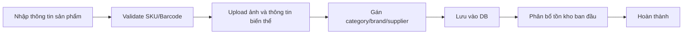
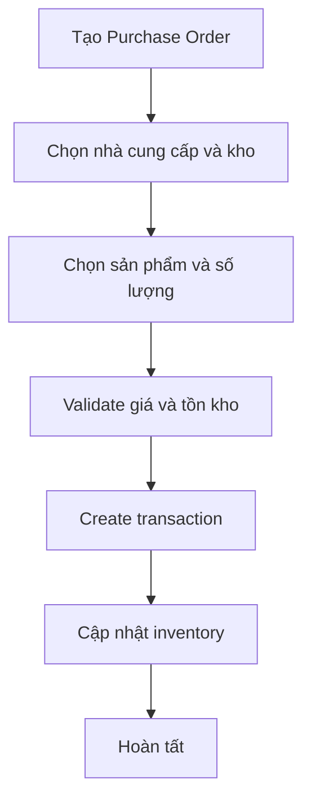
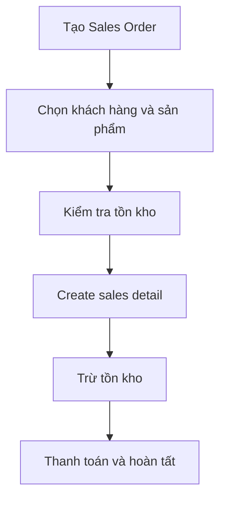
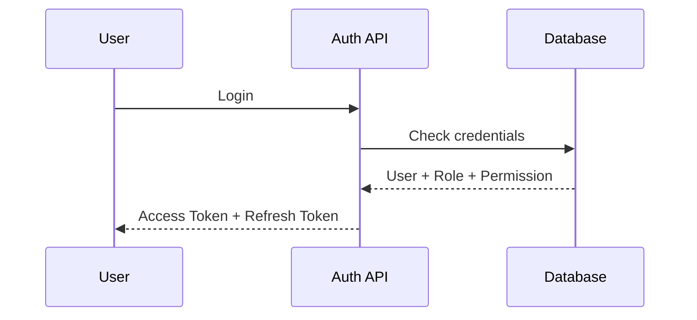

# 04. Business Flow

## 1. Luồng quản lý sản phẩm


## 2. Luồng quét barcode
```mermaid
flowchart TD
    A[Camera hoặc nhập tay] --> B[Barcode Scanner]
    B --> C[Decode barcode]
    C --> D[GET /products/barcode/{barcode}]
    D --> E[Kiểm tra DB]
    E --> F[Hiển thị thông tin sản phẩm]
```

## 3. Luồng nhập kho


## 4. Luồng bán hàng


## 5. Luồng xác thực và phân quyền


## 6. Business rules
- Không được tạo sản phẩm với barcode trùng.
- Không được bán vượt quá tồn kho hiện có.
- Mọi thay đổi kho đều phải có người tạo và timestamp.
- Mọi đơn mua/bán cần có trạng thái rõ ràng.

## 7. Vì sao luồng này hiệu quả
- Rõ ràng về trách nhiệm và thứ tự xử lý.
- Dễ kiểm tra lỗi và audit.
- Dễ mở rộng thêm workflow phê duyệt hoặc multi-step approval.
