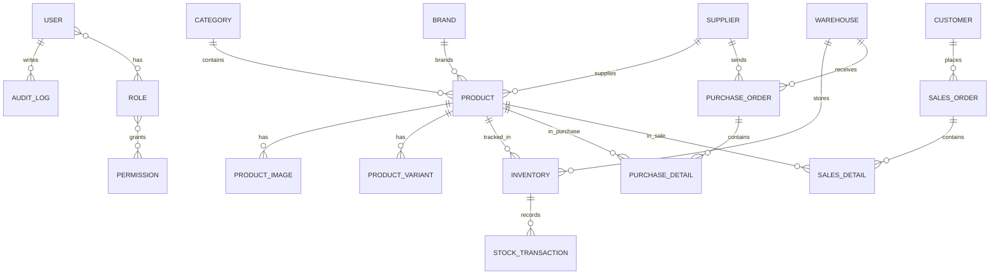

# 05. ERD Design

## 1. Mục tiêu ERD
Thiết kế dữ liệu theo chuẩn 3NF, có foreign key, unique, constraint, index và transaction. Mỗi thực thể đều có trách nhiệm rõ ràng và quan hệ được chuẩn hóa.

## 2. Entitites chính
| Entity | Vai trò |
|---|---|
| User | Người dùng hệ thống |
| Role | Vai trò |
| Permission | Quyền hạn |
| Product | Sản phẩm |
| Category | Danh mục |
| Brand | Thương hiệu |
| Supplier | Nhà cung cấp |
| Warehouse | Kho |
| Inventory | Tồn kho |
| StockTransaction | Giao dịch kho |
| PurchaseOrder | Đơn mua |
| PurchaseDetail | Chi tiết đơn mua |
| SalesOrder | Đơn bán |
| SalesDetail | Chi tiết đơn bán |
| Customer | Khách hàng |
| Employee | Nhân viên |
| Notification | Thông báo |
| AuditLog | Nhật ký hệ thống |
| FileUpload | File đính kèm |
| ProductImage | Ảnh sản phẩm |
| ProductVariant | Biến thể |
| SystemSetting | Cấu hình hệ thống |

## 3. ER Diagram

## 4. Các quan hệ quan trọng
- Category 1-N Product
- Brand 1-N Product
- Supplier 1-N Product
- Product 1-N ProductImage
- Product 1-N ProductVariant
- Warehouse 1-N Inventory
- Product 1-N Inventory
- Inventory 1-N StockTransaction
- PurchaseOrder 1-N PurchaseDetail
- SalesOrder 1-N SalesDetail
- User 1-N AuditLog
- User N-N Role
- Role N-N Permission

## 5. Design rationale
- Dùng entity riêng cho inventory và stock transaction để bảo toàn lịch sử thay đổi tồn kho.
- Tách purchase/sales detail riêng để hỗ trợ chính sách giá, số lượng và audit rõ ràng.
- Dùng soft delete ở level entity để tránh mất dữ liệu lịch sử.

## 6. Cải tiến đề xuất
- Nếu có lot/serial, nên thêm bảng LotBatch và SerialNumber.
- Nếu có nhiều đơn vị tiền tệ, nên thêm Currency và PriceHistory.
