# 06. Class Diagram

## 1. Mục tiêu
Mô hình hóa kiến trúc Clean Architecture bằng cách tách riêng các tầng: Controller, DTO, Use Case, Service, Repository, Entity và Infrastructure.

## 2. Cấu trúc lớp chính

```mermaid
classDiagram
    class User {
        +id
        +username
        +email
        +passwordHash
        +status
        +lastLogin
        +createAt()
        +updateAt()
        +deleteAt()
    }

    class Role {
        +id
        +name
        +description
    }

    class Permission {
        +id
        +code
        +name
    }

    class Product {
        +id
        +sku
        +barcode
        +name
        +salePrice
        +costPrice
        +status
    }

    class Inventory {
        +id
        +quantity
        +minimumQuantity
        +maximumQuantity
    }

    class StockTransaction {
        +id
        +transactionType
        +quantity
        +beforeQuantity
        +afterQuantity
    }

    class PurchaseOrder {
        +id
        +status
        +totalAmount
    }

    class PurchaseDetail {
        +id
        +quantity
        +price
    }

    class SalesOrder {
        +id
        +status
        +totalAmount
    }

    class SalesDetail {
        +id
        +quantity
        +price
    }

    class AuthController {}
    class ProductController {}
    class InventoryController {}
    class PurchaseController {}
    class SalesController {}

    class AuthUseCase {}
    class ProductUseCase {}
    class InventoryUseCase {}
    class PurchaseUseCase {}
    class SalesUseCase {}

    class UserRepository {}
    class ProductRepository {}
    class InventoryRepository {}
    class PurchaseOrderRepository {}
    class SalesOrderRepository {}

    class JwtService {}
    class RedisCache {}
    class RabbitMqPublisher {}
    class FileStorage {}

    AuthController --> AuthUseCase
    ProductController --> ProductUseCase
    InventoryController --> InventoryUseCase
    PurchaseController --> PurchaseUseCase
    SalesController --> SalesUseCase

    ProductUseCase --> ProductRepository
    ProductUseCase --> FileStorage
    InventoryUseCase --> InventoryRepository
    PurchaseUseCase --> PurchaseOrderRepository
    SalesUseCase --> SalesOrderRepository

    AuthUseCase --> JwtService
    AuthUseCase --> RedisCache
    InventoryUseCase --> RabbitMqPublisher
```

## 3. Mô tả lớp
- Controller: nhận request và trả response.
- DTO: định nghĩa input/output.
- Mapper: chuyển đổi giữa entity và DTO.
- Use Case: chứa nghiệp vụ chính.
- Service: triển khai logic chung và phụ trợ.
- Repository Interface: abstraction cho persistence.
- Repository Implementation: Prisma/Postgres implementation.

## 4. Design Pattern áp dụng
- Repository Pattern
- Factory Pattern cho tạo kho, đơn hàng, notification
- Strategy Pattern cho các loại giao dịch kho
- Observer Pattern cho notification và audit log
- Dependency Injection

## 5. SOLID áp dụng
- Single Responsibility: mỗi class chỉ có một lý do thay đổi.
- Open/Closed: thêm loại transaction mới không cần sửa logic cũ.
- Liskov: repository interface có thể thay thế cho nhau.
- Interface Segregation: chia interface theo module.
- Dependency Inversion: use case phụ thuộc vào interface thay vì implementation.

## 6. Clean Code principles
- Tên biến và hàm rõ nghĩa.
- Tránh logic lồng nhau sâu.
- Logging và exception phải có cấu trúc.
