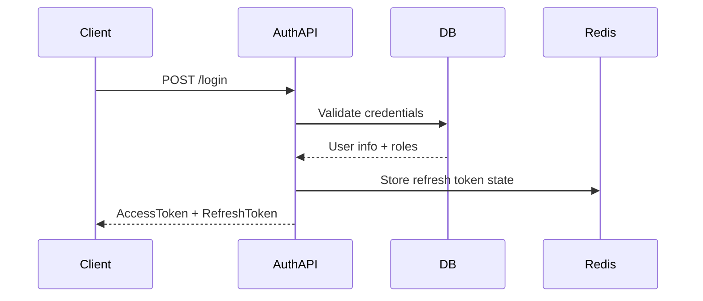
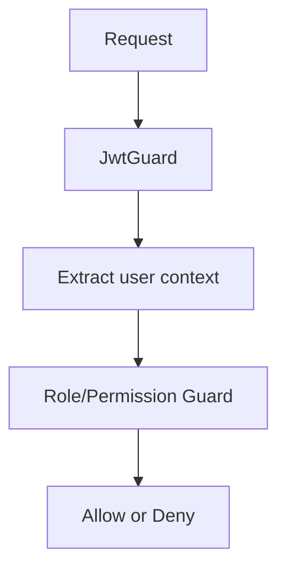

# 09. Security Design

## 1. Security goals
- Chỉ người dùng hợp lệ mới truy cập được API.
- Ngăn chặn bypass quyền và dữ liệu bị lộ.
- Ghi nhận các hành động nhạy cảm và phòng chống abuse.

## 2. Authentication flow

## 3. Authorization flow

## 4. Security controls
| Layer | Control |
|---|---|
| API | JWT auth, refresh token, rate limit |
| Application | RBAC, validation, audit log |
| Database | FK, constraint, encryption at rest |
| File Storage | Signed URLs, MIME allowlist |
| Infrastructure | TLS, secrets manager, container hardening |

## 5. Recommended security implementation
- Bcrypt/Argon2 cho password hashing.
- Access token ngắn hạn, refresh token dài hạn và có thể revoke.
- Role-based permission với permission code.
- Validate input ở DTO và controller.
- Log IP, user, action, entity, old/new value.

## 6. Rủi ro cần lưu ý
- Token bị đánh cắp.
- XSS trong frontend nếu render nội dung người dùng không an toàn.
- File upload có thể bị abuse nếu không validate kiểu file.

## 7. Vì sao thiết kế này
- Phù hợp với doanh nghiệp và production-grade system.
- Dễ tích hợp với SSO, OAuth2 hoặc Active Directory sau này.
