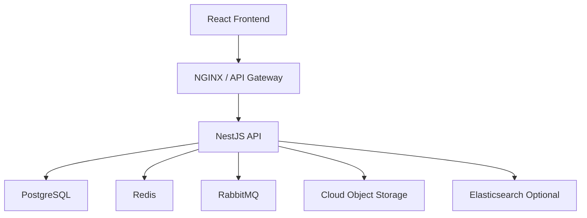

# 10. Deployment Architecture

## 1. Mục tiêu triển khai
Hệ thống cần có thể chạy ở môi trường doanh nghiệp với khả năng mở rộng, backup, monitoring và containerized deployment.

## 2. Suggested Architecture


## 3. Container deployment
- Frontend: React + Vite served by Nginx.
- Backend: NestJS container.
- Database: PostgreSQL container or managed PostgreSQL.
- Cache: Redis container.
- Queue: RabbitMQ container.
- Storage: S3-compatible storage hoặc Azure Blob Storage.

## 4. Docker Compose architecture
```yaml
services:
  postgres:
    image: postgres:16
  redis:
    image: redis:7
  rabbitmq:
    image: rabbitmq:3-management
  backend:
    build: ./backend
  frontend:
    build: ./frontend
```

## 5. CI/CD pipeline đề xuất
1. Developer push code.
2. CI chạy lint, test, build.
3. Build Docker image.
4. Push image to registry.
5. Deploy to staging.
6. Smoke test.
7. Promote to production.

## 6. Monitoring và observability
- Prometheus + Grafana.
- Application logs to ELK stack.
- Alert khi error rate, latency, DB connection pool vượt ngưỡng.

## 7. Vì sao thiết kế này
- Dễ triển khai trên Docker Compose hoặc Kubernetes.
- Phù hợp cho môi trường private cloud hoặc public cloud.
- Có thể mở rộng theo nhu cầu.

## 8. Phương án thay thế
- Nếu chỉ cần triển khai nhỏ, có thể dùng monolith + single PostgreSQL + Redis.
- Nếu doanh nghiệp lớn, nên dùng Kubernetes và managed services.
