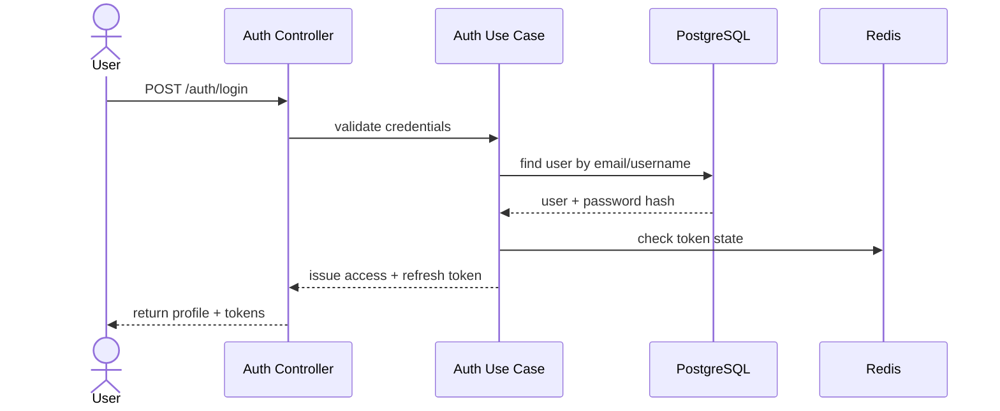
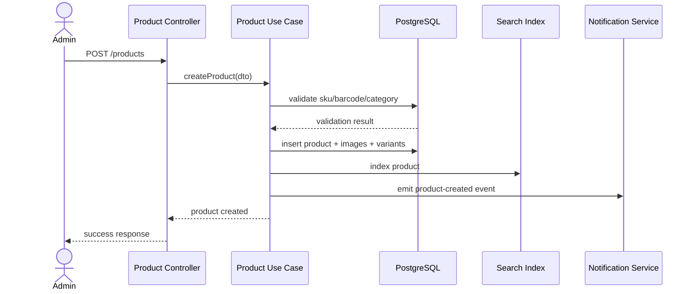
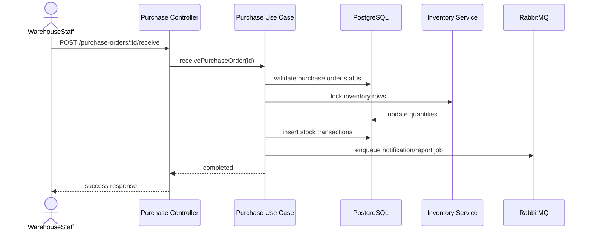
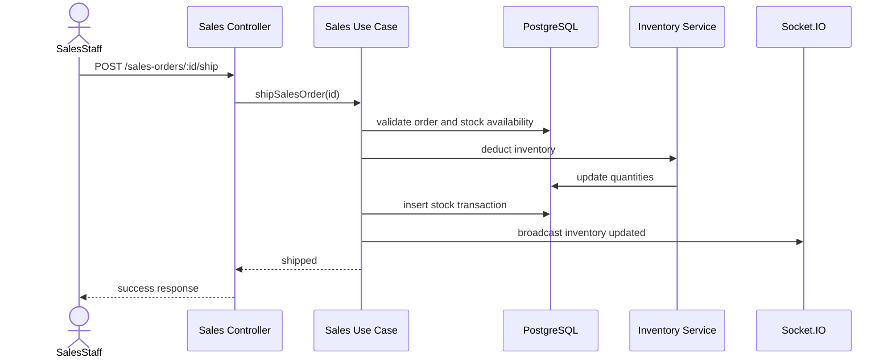
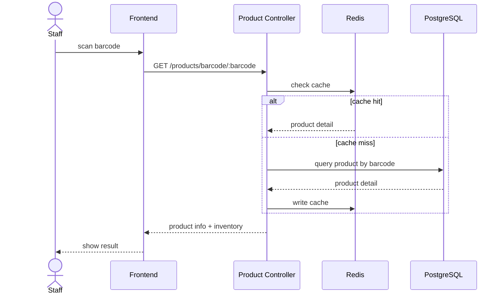

# 11. Sequence Diagram

## 1. Mục tiêu
Sequence diagram giúp mô tả trực quan luồng tương tác giữa các actor, controller, use case, service và persistence layer trong các nghiệp vụ cốt lõi.

## 2. Sequence Diagram: Authentication

## 3. Sequence Diagram: Create Product

## 4. Sequence Diagram: Purchase Receive

## 5. Sequence Diagram: Sales Ship

## 6. Sequence Diagram: Barcode Lookup

## 7. Design rationale
- Sequence diagram giúp team hiểu giao tiếp giữa các layer và giảm rủi ro khi triển khai thực tế.
- Với nghiệp vụ kho, việc thể hiện khóa tồn kho và transaction là rất quan trọng.
- Qua các luồng này, có thể thấy nơi nào nên dùng cache, queue, event hoặc websocket.

## 8. Phương án thay thế
- Nếu không cần quá chi tiết, có thể dùng simple flowchart thay cho sequence diagram.
- Với hệ thống lớn, nên bổ sung sequence diagram cho integrator service và payment gateway sau này.
