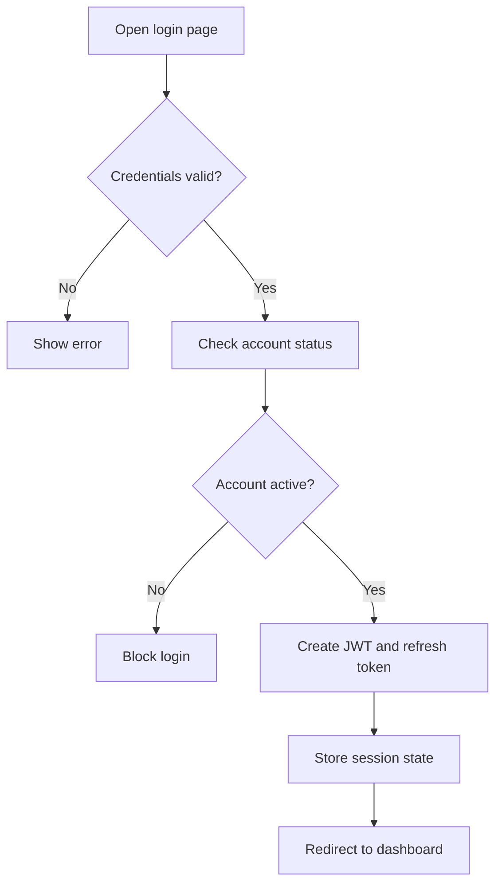
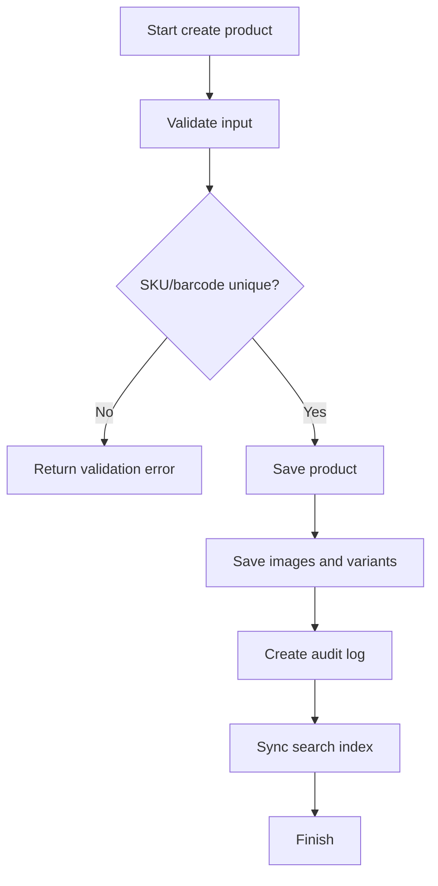
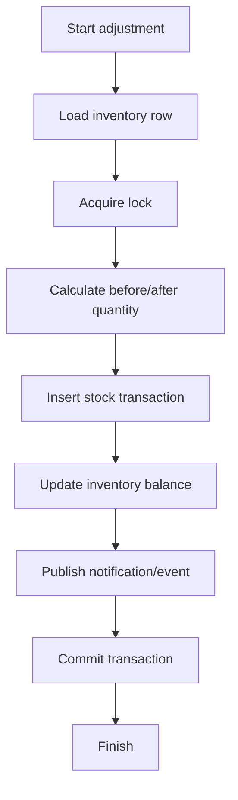
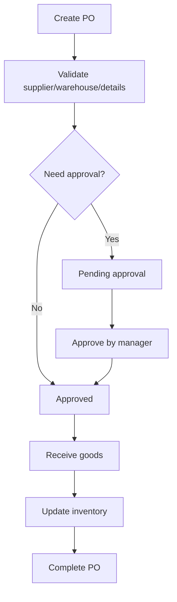
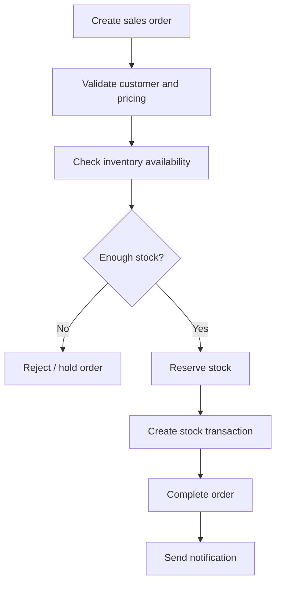
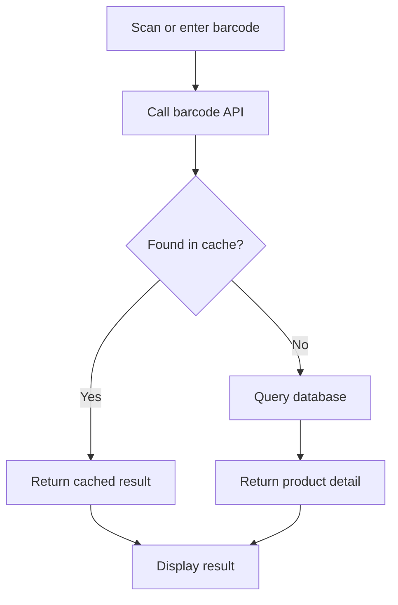

# 12. Activity Diagram

## 1. Mục tiêu
Activity diagram mô tả quy trình nghiệp vụ theo từng bước, đặc biệt phù hợp với luồng nhập kho, bán hàng, kiểm kê và tìm kiếm sản phẩm.

## 2. Activity Diagram: Login Flow

## 3. Activity Diagram: Product Creation

## 4. Activity Diagram: Inventory Adjustment

## 5. Activity Diagram: Purchase Order Flow

## 6. Activity Diagram: Sales Order Flow

## 7. Activity Diagram: Barcode Search Flow

## 8. Design rationale
- Activity diagram giúp nhiều bên liên quan hiểu luồng nghiệp vụ rõ hơn, đặc biệt cho đội vận hành và test.
- Với nghiệp vụ kho và bán hàng, việc nêu rõ điều kiện rẽ nhánh giúp giảm lỗi business rule.
- Đây là tài liệu tốt để làm base cho test case và UAT.
